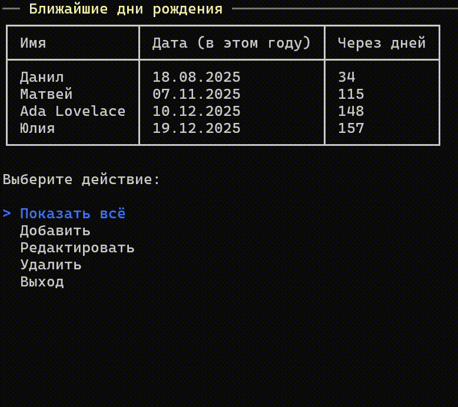
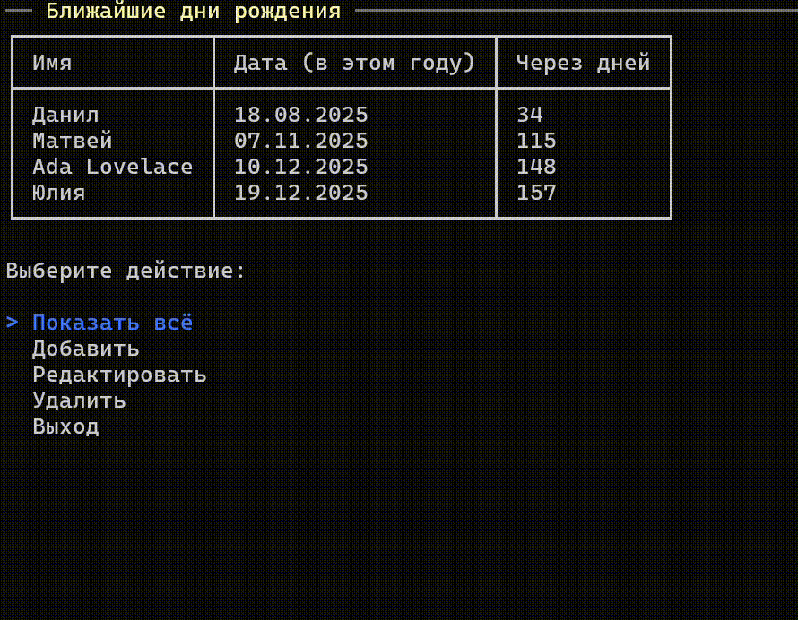
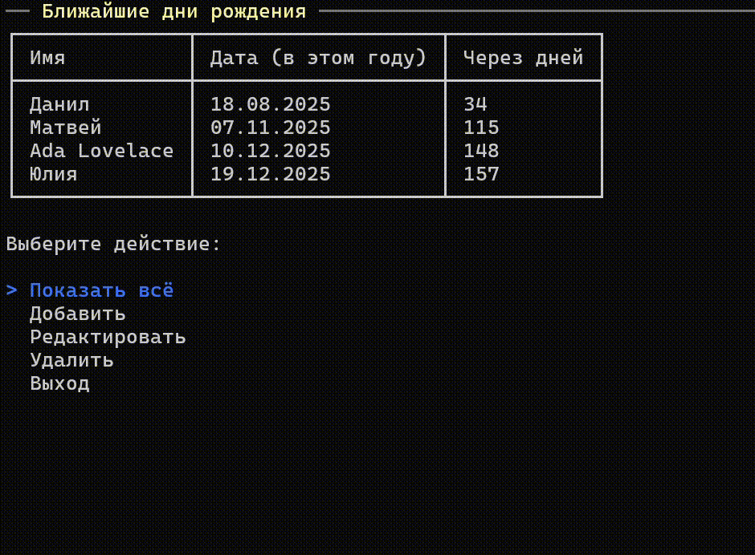
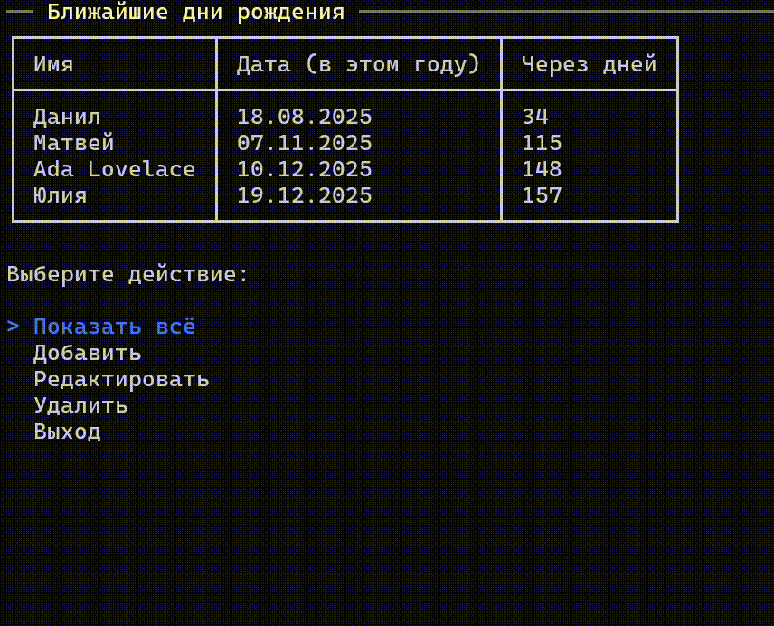

# Консольное приложение «Поздравлятор»

---

Небольшая консольная программка на .NET, позволяющая вести список дней рождения ваших друзей и не оставить без внимания ни одного именинника. Утилита хранит дни рождения друзей, показывает сегодняшние и ближайшие даты и позволяет управлять списком через красочный текстовый интерфейс.

---
## Содержание

1. [О проекте](#о-проекте)
2. [Архитектура и стек](#архитектура-и-стек)
3. [Установка и запуск](#установка-и-запуск)
4. [Сборка проекта](#сборка-проекта)

---
## О проекте

`Поздравлятор` — учебный проект, написанный C#. Консольное приложение "из коробки" работает с SQLite, но также поддерживает полную интеграцию с PostgreSQL. 

### Обзор функционала

Отображение всего списка дней рождения:


Добавление нового элемента:


Редактирование уже существующего элемента:


Удаление элемента:


---
## Архитектура и стек

### Архитектура

Приложение спроектировано с использованием Clean Architecture (Domain → Application → Infrastructure → UI). UML-диаграмма классов выглядит следующим образом:

![[docs/Диаграмма.png]]

### Используемый стек

Основные пакеты:
- Microsoft.EntityFrameworkCore
- Microsoft.EntityFrameworkCore.Sqlite
- Npgsql.EntityFrameworkCore.PostgreSQL
Текстовый UI спроектирован при помощи библиотеки [Spectre.Console](https://github.com/spectreconsole/spectre.console).

---
## Установка и запуск

Последний релиз можно найти [здесь](https://github.com/matthewSher/congratulator-console/releases/tag/v1.0.0)
На данный момент доступна только версия для ОС Windows. Скачайте архив `Congratulator-win-x64.zip`, распакуйте его в любое удобное место и запустите скрипт:

```
# Windows + SQLite
run-sqlite.bat

# Windows + PostgreSQL
run-postgres.bat
```

Скрипты отличаются лишь наличием флага `--sqlite`. При запуске исполняемого файла (`Congratulator.ConsoleApp.exe`) напрямую, по умолчанию будет использоваться PostgreSQL. 

### Использование PostgreSQL

Для того, чтобы использовать PostgreSQL, необходимо в конфигурационном файле `appsettings.Postgres.json`, вставить свой ключ подключения к базе данных (например, `Host=localhost;Port=5432;Database=CongratulatorDb;Username=postgres;Password=<Ваш пароль>`). Сделайте это здесь:

```json
{
  "ConnectionStrings": {
    "DefaultConnection": "<Ваш ключ подключения>"
  },
  "Logging": {
	// ...
  }
}
```

---
## Сборка проекта

Представлена для основных платформ.
*Примечание: для отладки проекта с использованием PostgreSQL уберите флаг `--sqlite`*
### Windows

Отладка:
```powershell
git clone https://github.com/matthewSher/congratulator-console.git
cd congratulator-console
dotnet run --project src/Congratulator.ConsoleApp -- --sqlite
```

Релиз:
```powershell
dotnet publish src/Congratulator.ConsoleApp `
  -c Release -r win-x64 `
  --self-contained -p:PublishSingleFile=true `
  -o publish
```

### Linux

Отладка:
```bash
git clone https://github.com/matthewSher/congratulator-console.git
cd congratulator-console
dotnet run --project src/Congratulator.ConsoleApp --sqlite
```

Релиз:
```bash
dotnet publish src/Congratulator.ConsoleApp -c Release -r linux-x64 \
  --self-contained -p:PublishSingleFile=true -o publish
```

### macOS

Отладка:
```bash
git clone https://github.com/matthewSher/congratulator-console.git
cd congratulator-console
dotnet run --project src/Congratulator.ConsoleApp --sqlite
```

Релиз:
```bash
# macOS Intel
dotnet publish src/Congratulator.ConsoleApp -c Release -r osx-x64 \
  --self-contained -p:PublishSingleFile=true -o publish

# macOS Apple Silicon
dotnet publish src/Congratulator.ConsoleApp -c Release -r osx-arm64 \
  --self-contained -p:PublishSingleFile=true -o publish
```